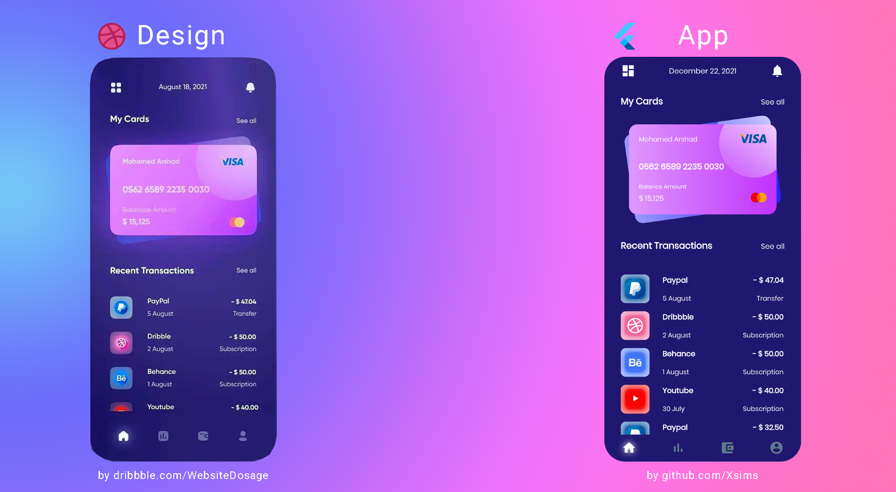

<h1 align="center">Banking App</h1>

  

  
Banking App is a one screen project based on <a href="https://dribbble.com/shots/16917970-Fintech-app-design?utm_source=Clipboard_Shot&utm_campaign=Website_Dosage&utm_content=Fintech%20app%20design&utm_medium=Social_Share&utm_source=Clipboard_Shot&utm_campaign=Website_Dosage&utm_content=Fintech%20app%20design&utm_medium=Social_Share">Website Dosage</a> design without any business logic.
 This project is intended to focus only on integrating the design with <a href="https://flutter.dev/">Flutter</a> 

 

 

## Tech stack & Open-source libraries
- Minimum SDK level 16
- [Flutter](https://github.com/flutter/flutter.git) 2.8.0 channel stable + [Dart](https://dart.dev/) 2.15.0
- [palette_generator](https://pub.dev/packages/palette_generator) to extract the dominant color of the Company logo from transactions.
- [google_fonts](https://pub.dev/packages/google_fonts) to add *Poppins* which seems to match the dribbble design.
- [flutter_lints](https://pub.dev/packages/flutter_lints) - This package contains a recommended set of lints for Flutter apps, packages, and plugins to encourage good coding practices.
- [decorated_icon](https://pub.dev/packages/decorated_icon) to highlight selected icon in BottomNavigationBar.
